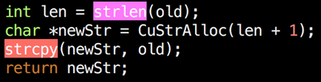

# vim-banned

`vim-banned` is a syntax highlighting plugin for Vim (and any fork or clone that supports Vimscript, such as Neovim). Its purpose is to draw attention to [application programming interfaces (APIs)](https://en.wikipedia.org/wiki/Application_programming_interface) that are considered dangerous, if for no other reason than the fact that they are frequently misused. Although suspect APIs have been discussed in security circles for decades, Microsoft's [Security Development Lifecycle (SDL)](https://www.microsoft.com/en-us/securityengineering/sdl/) has brought the concept into the spotlight. Although the SDL remains focused on the [Win32](https://en.wikipedia.org/wiki/Windows_API#Win32) API, many of these APIs have Unix counterparts that are similarly problematic.

Banned APIs should not be used in new code, and should be removed from legacy code as time permits. Microsoft has banned APIs for many reasons, but a failure to properly bounds check input is a common trend. All of the APIs highlighted by this plugin were originally documented in [Security Development Lifecycle (SDL) Banned Function Calls](https://msdn.microsoft.com/en-us/library/bb288454.aspx) by Michael Howard. That document defines APIs that are required to be banned and APIs that are recommended to be banned.

> For the functions marked as "recommended", please consider this a strong recommendation and evaluate the function against your own security requirements, elevating them to "required" as necessary. In any case, none of the listed banned functions should be used in new code.
> —<cite>Michael Howard</cite>

The `vim-banned` plugin applies color syntax highlighting to banned APIs in order to draw attention to their use. APIs that are required banned show up in reverse red, while APIs that are recommended banned show up in reverse magenta. The following illustrates the plugin in action:



<cite>__Source:__ Non-compliant example from [SEI CERT C Coding Standard](https://wiki.sei.cmu.edu/confluence/display/c/SEI+CERT+C+Coding+Standard) rule, [MSC24-C. Do not use deprecated or obsolescent functions](https://wiki.sei.cmu.edu/confluence/display/c/MSC24-C.+Do+not+use+deprecated+or+obsolescent+functions).</cite>

The sudden appearance of reverse red or magenta while programming should alert you to the fact that you need to think about what you are doing. If nothing else, check the documentation to ensure that you are using the function correctly and are aware of all security implications. In addition to programming, this plugin is useful to those analyzing source code for potential security defects. Look for functions highlighted red or magenta and trace the path of execution and see if you can control its input.

The current version is up-to-date with the [canonical banned.h distribution](https://github.com/x509cert/banned), which is dated _18-May-2018_ at the time of writing.

## Installation

If you don't have a preferred installation method, I recommend using [vim-plug](https://github.com/junegunn/vim-plug), although any manager will do. Knock yourself out.

For `vim-plug`:

```vim
Plug 'yesmar/vim-banned'
```

For `pathogen`:

```bash
git clone https://github.com/yesmar/vim-banned ~/.vim/bundle/vim-banned
```

Others remain an exercise for you, dear reader.

## Acknowledgements

* [Michael Howard](https://github.com/x509cert) and [Microsoft](https://www.microsoft.com/en-us/) for making the [banned.h](https://github.com/x509cert/banned) header file available for public use
* Tim Pope for his sweet [CONTRIBUTING](https://github.com/tpope/vim-rails/blob/master/CONTRIBUTING.markdown) statement

## License

Copyright © Ramsey Dow. Distributed under the same terms as [Vim](http://www.vim.org) itself. See [`:help license`](http://vimdoc.sourceforge.net/htmldoc/uganda.html).
